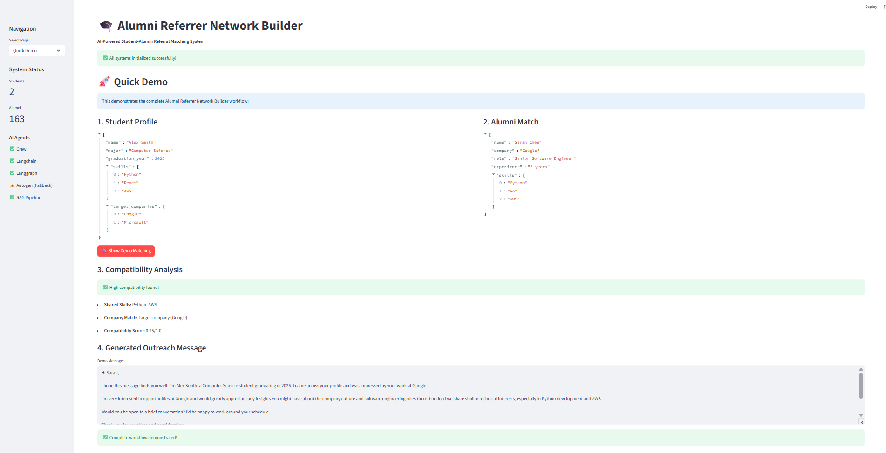

# Alumni Referrer Network Builder

An AI-powered system that activates alumni networks to improve student referrals during campus placements. The system uses multiple AI agent frameworks (CrewAI, LangChain, LangGraph, and AutoGen) with Retrieval-Augmented Generation (RAG) to create optimal referral paths and personalized outreach messages.

## 🎯 Project Overview

**Problem Statement:** Alumni are underutilized as referral bridges to top companies during campus placements.

**Solution:** Build an AI system that activates alumni networks to improve student referrals through intelligent matching and automated outreach.

## 🏗️ System Architecture

The system consists of four specialized AI agents:

1. **Alumni Network Mining Agent (CrewAI + RAG)** - Extracts and processes alumni data from LinkedIn-like platforms
2. **Domain Alignment Agent (LangChain)** - Matches student interests and skills with alumni expertise
3. **Referral Path Recommender Agent (LangGraph)** - Constructs optimal outreach paths and strategies
4. **Outreach Message Generator Agent (AutoGen)** - Creates personalized referral request messages

## 🚀 Features

- **Multi-Agent AI System**: Four different AI frameworks working together
- **RAG Implementation**: Intelligent document retrieval and generation using ChromaDB
- **Dynamic Alumni Mining**: Automated extraction of alumni profiles
- **Smart Matching**: Advanced compatibility scoring between students and alumni
- **Path Optimization**: Multi-step referral path planning with success probability analysis
- **Personalized Messaging**: Auto-generated, context-aware outreach messages
- **Interactive Dashboard**: Real-time analytics and visualizations
- **MongoDB Integration**: Scalable data storage and management

## 🛠️ Technology Stack

- **Backend**: Python 3.10+
- **AI Frameworks**: CrewAI, LangChain, LangGraph, AutoGen
- **LLM**: Google Gemini 1.5 Flash
- **Vector Database**: ChromaDB
- **Database**: MongoDB
- **Frontend**: Streamlit
- **Embeddings**: Sentence Transformers
- **Visualization**: Plotly, Pandas

## 📁 Project Structure

```
alumni_referrer_network/
│
├── requirements.txt
├── .env.example
├── main.py
├── config/
│   ├── __init__.py
│   └── settings.py
│
├── database/
│   ├── __init__.py
│   ├── mongodb_client.py
│   └── models.py
│
├── agents/
│   ├── __init__.py
│   ├── base_agent.py
│   ├── crew_agent.py          # Alumni Network Mining Agent (CrewAI)
│   ├── langchain_agent.py     # Domain Alignment Agent (LangChain)
│   ├── langgraph_agent.py     # Referral Path Recommender (LangGraph)
│   └── autogen_agent.py       # Outreach Message Generator (AutoGen)
│
├── rag/
│   ├── __init__.py
│   ├── vector_store.py
│   ├── embeddings.py
│   ├── retriever.py
│   └── rag_pipeline.py
│
├── services/
│   ├── __init__.py
│   ├── linkedin_scraper.py
│   ├── alumni_service.py
│   ├── student_service.py
│   └── referral_service.py
│
├── ui/
│   ├── __init__.py
│   ├── streamlit_app.py
│   └── components/
│       ├── __init__.py
│       ├── dashboard.py
│       ├── student_form.py
│       ├── alumni_view.py
│       └── referral_results.py
│
├── utils/
│   ├── __init__.py
│   ├── logger.py
│   ├── helpers.py
│   └── validators.py
│
├── data/
│   ├── sample_alumni.json
│   └── sample_students.json
│
└── README.md
```

## ⚙️ Installation & Setup

### Prerequisites

- Python 3.10 or higher
- MongoDB (local or cloud)
- Google AI API key (for Gemini)

### 1. Clone the Repository

```bash
git clone <repository-url>
cd alumni_referrer_network
```

### 2. Create Virtual Environment

```bash
python -m venv venv
source venv/bin/activate  # On Windows: venv\Scripts\activate
```

### 3. Install Dependencies

```bash
pip install -r requirements.txt
```

### 4. Environment Configuration

Create a `.env` file based on `.env.example`:

```bash
cp .env.example .env
```

Edit `.env` with your configuration:

```env
GOOGLE_API_KEY=your_gemini_api_key_here
MONGODB_URI=mongodb://localhost:27017/
DATABASE_NAME=alumni_network
LINKEDIN_EMAIL=your_linkedin_email
LINKEDIN_PASSWORD=your_linkedin_password
LOG_LEVEL=INFO
```

### 5. Start MongoDB

Make sure MongoDB is running:

```bash
# For local MongoDB
mongod

# Or use Docker
docker run -d -p 27017:27017 --name mongodb mongo:latest
```

### 6. Run the Application

```bash
python main.py
```

The Streamlit application will start at `http://localhost:8501`

## 📊 Usage Guide

### 1. Dashboard
- View system overview and analytics
- Monitor alumni network growth
- Track referral success rates

### 2. Student Profile Management
- Create detailed student profiles
- Specify target companies and roles
- Define skills and interests

### 3. Alumni Network
- Mine alumni data from various sources
- View and filter alumni profiles
- Search alumni using semantic queries

### 4. Find Referrals
- Run domain alignment analysis
- Generate optimized referral paths
- Review compatibility scores and recommendations

### 5. Generate Messages
- Create personalized outreach messages
- Generate multiple message variations
- Get timing and follow-up recommendations

### 6. Analytics
- Analyze alumni distribution
- Track referral success patterns
- Monitor system performance

## 🤖 AI Agents Details

### CrewAI Alumni Mining Agent
- **Purpose**: Extract and process alumni data
- **Features**: 
  - Multi-source data collection
  - Profile validation and enrichment
  - Company intelligence analysis
- **RAG Integration**: Stores alumni profiles in vector database

### LangChain Domain Alignment Agent
- **Purpose**: Match students with compatible alumni
- **Features**:
  - Skill compatibility scoring
  - Career path analysis
  - Industry alignment assessment
- **Tools**: Custom LangChain tools for profile analysis

### LangGraph Referral Path Agent
- **Purpose**: Create optimal referral strategies
- **Features**:
  - Multi-step path planning
  - Success probability calculation
  - Risk factor identification
- **Workflow**: State-based graph execution

### AutoGen Message Generation Agent
- **Purpose**: Generate personalized outreach messages
- **Features**:
  - Multi-agent collaboration
  - Message variation generation
  - Psychological optimization
- **Agents**: Strategist, Writer, Psychologist, Reviewer


## 🔧 Configuration Options

### Model Configuration
- **Primary LLM**: Gemini 1.5 Flash
- **Embedding Model**: sentence-transformers/all-MiniLM-L6-v2
- **Temperature**: 0.7 (configurable)
- **Max Tokens**: 4000 (configurable)

### Agent Configuration
- **Max Iterations**: 5 per agent
- **Timeout**: 300 seconds
- **Retry Logic**: 3 attempts with exponential backoff

### RAG Configuration
- **Vector Dimensions**: 384 (based on embedding model)
- **Similarity Threshold**: 0.5 (configurable)
- **Max Retrieved Documents**: 10 (configurable)

## 📊 Performance Metrics

The system tracks various metrics:

- **Alumni Mining Success Rate**: Percentage of successful profile extractions
- **Domain Alignment Accuracy**: Quality of student-alumni matches
- **Referral Path Optimization**: Success probability predictions
- **Message Generation Quality**: Personalization scores and engagement rates
